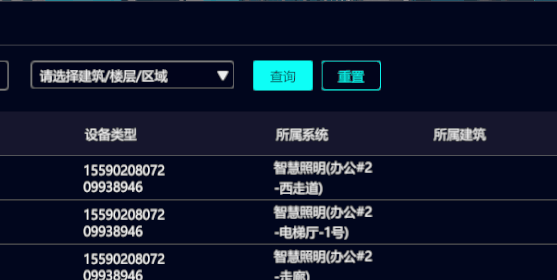
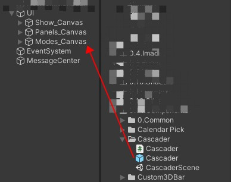
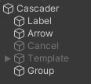

## 级联组件

​	*按照层级递进选择数据*

### 组件预览

 

介绍：按照层级递进选择，如果选择最后一级自动关闭。选择当前层级后直接点击外部空白处保存当前选择。选择完成后点击右侧清除按钮可以清除当前所有选择

### 快速开始

 

1. 打开Cascader文件夹

2. 将Cascader预制体拖拽到你喜欢的位置

3. 打开你自己的脚本 ，复制下边的代码

   ```c#
     	[SerializeField]
     	private Cascader cascader;
   	
    	public void InitPanel()
       {
           cascader.Init(CascaderCallback);//初始化组件，传入回调函数
       }
   
   	private void CascaderCallback(List<string> keys)
       {
           //将所有回调数据拆分。
           //如果对于这种写法有疑问，请继续向下查看文档
           var length = keys.Count;
           buildId = length >= 2 ? keys[1] : "";
           floorId = length >= 4 ? keys[3] : "";
           regionId = length >= 6 ? keys[5] : "";
   
       }
   ```

4. 尽情的使用级联组件吧！

### 组件介绍

 

组件结构如图所示，如无特殊需求不需要更改与添加。

- Cascader：组件主要父节点，更改Image图片即可更改背景图。
- Label：显示当前所选数据的Text
- Arrow：下拉框中箭头图标，可以更换
- Cancel：重置按钮，点击后清除当前所有选择，可以更换图标
- Template：用于生成选择下拉框界面的模板，可以更改其中Item样式
- Group：生成的下拉界面的容器，使用者无需关心。

### API相关

- 初始化相关
  ```c#
  Init(string str,UnityAction<string,string> callBack = null) //传入json字符串数据、回调方法初始化。此回调只会返回最后一次点击数据的label、value
  Init(string str,UnityAction<List<string>> callBack = null)//传入json字符串数据、回调方法初始化。此回调会返回所有点击的数据label、value。按照点击顺序塞入列表，label在前，value在后。
  Init(Option option, UnityAction<string, string> callBack=null)//传入特定的数据结构、回调方法初始化。
  Init(UnityAction<string, string> callBack)//只传入回调方法。不传数据
  Init(UnityAction<List<string>> callBack)//只传入回调方法。不传数据
  ```

- 数据更新相关
  ```c#
  UpDateMenu(string str)//用于更新下拉框数据，更新时会自动关闭面板
  UpDateMenu(Option option)//用于更新下拉框数据，更新时会自动关闭面板
  Re()//重置组件，清除当前所有选择。触发回调函数。数据为空。
  ```

- 数据相关

  组件数据更新有两种格式：Json数据格式与Option类结构

  ```json
  //json数据格式
  [
      {
          “value“: “zhejiang“,
          “label“: “Zhejiang“,
          “children“: [
              {
                  “value“: “hangzhou“,
                  “label“: “Hangzhou“,
                  “children“: [
                      {
                          “value“: “xihu“,
                          “label“: “West Lake“,
                          “children“:[]
                      }
                  ]
              }
          ]
      },
      {
          “value“: “jiangsu1“,
          “label“: “Jiangsu“,
          “children“: [
              {
                  “value“: “nanjing1“,
                  “label“: “Nanjing“,
                  “children“: [
                      {
                          “value“: “zhonghuamen“,
                          “label“: “Zhong Hua Men“,
                          “children“:[]
                      }
                  ]
              }
          ]
      }
  ]
  ```

  <font color=orange >注意：json数据应是数组传入。如果是对象传入会报错。</font> 

  ```c#
  public class Option
  {
      public string value;
      public string label;
      public List<Option> children;
  }
  ```

  
